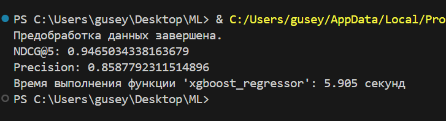

# Описание процесса обучения

В процессе работы с данными я попробовал несколько различных моделей машинного обучения. Включая:

- Линейная регрессия
- XGBoost
- CatBoost
- Случайные деревья
- Логистическая регрессия

После проведения экспериментов я остановился на модели градиентного бустинга XGBoost. Эта модель проявила себя с лучшей стороны благодаря своей относительно невысокой вычислительной сложности и высокому качеству обучения.

Для оценки качества моделей я использовал две метрики: NDCG@5 и precision.

### Описание работы кода:

Этот скрипт загружает данные из CSV-файла и предварительно обрабатывает их, включая сортировку документов внутри каждой сессии по их рангу. Затем он масштабирует признаки и разделяет данные на обучающий и тестовый наборы. Для обучения модели машинного обучения используется XGBoost, поскольку он показал высокую производительность и качество обучения при небольшом времени выполнения. Для оценки качества модели используются метрики NDCG@5 и precision. После обучения модели выводится время выполнения функции и полученные оценки качества.

Из-за большого размера файла "intern_task.csv" его не удалось занести в гитхаб репозиторий, поэтому я оставлю ссылку на этот файл ниже, так как код предполагает его наличие.

[intern_task.csv](https://drive.google.com/file/d/1viFKqtYTtTiP9_EdBXVpCmWbNmxDiXWG/view)
